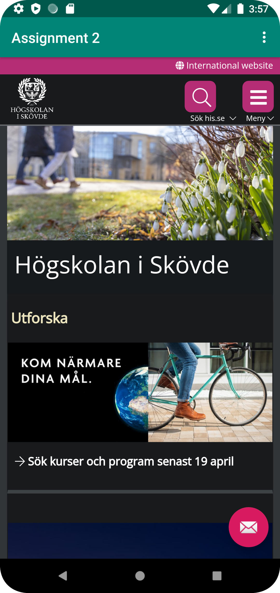
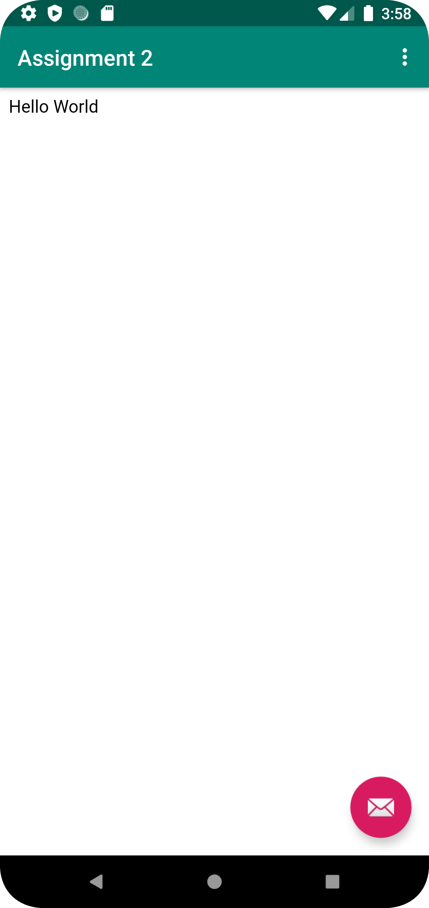

# Rapport

Jag döpte om appen och bytte ut TextView till en WebView.
Jag aktiverade internet åtkomst i appen och javascript i webviewclient,
därefter länka jag till en external och internal URL i passande funktion som sedan körs när man klickar på menyval.

```
<string name="app_name">Assignment 2</string>

myWebView = findViewById(R.id.my_webview);
myWebView.setWebViewClient(new WebViewClient());
myWebView.getSettings().setJavaScriptEnabled(true);

myWebView.loadUrl("https://his.se");

myWebView.loadUrl("file:///android_asset/internal.html");

```


